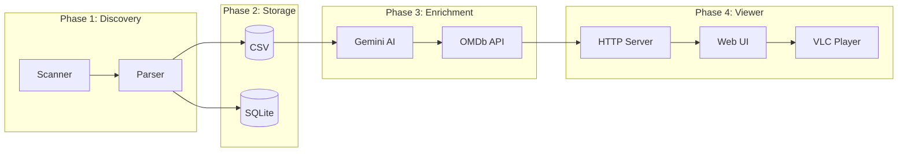

# Movie Library Indexing, Enrichment & Viewer System

## Overview
A Python-based system that scans local video files, enriches metadata using Gemini AI + OMDb API, and provides a web viewer with VLC playback.



---

## Configuration

| Setting | Value |
|---------|-------|
| Movie Directory | `D:\` |
| VLC Path | `C:\Program Files\VideoLAN\VLC\vlc.exe` |
| Video Extensions | `.mp4, .mkv, .avi, .mov, .wmv, .flv, .webm` |
| Server | Python `http.server` (no dependencies) |

---

## Project Structure

```
e:\0 Movie Project\
├── .env                    # API keys (user-provided)
├── config.py               # Central configuration
├── scanner.py              # File discovery
├── parser.py               # Name/year extraction
├── storage.py              # CSV + SQLite operations
├── gemini_client.py        # Gemini AI integration
├── omdb_client.py          # OMDb API integration
├── enricher.py             # Orchestrates enrichment pipeline
├── server.py               # HTTP server + API endpoints
├── main.py                 # Entry point
├── data/
│   ├── movies.csv          # Primary data store
│   └── movies.db           # SQLite mirror
└── web/
    ├── index.html          # Movie viewer UI
    ├── styles.css          # Styling
    └── app.js              # Frontend logic
```

---

## Database Schema

```sql
CREATE TABLE movies (
    -- Core identifiers
    uuid            TEXT PRIMARY KEY,
    file_name       TEXT NOT NULL,
    directory       TEXT NOT NULL,
    full_path       TEXT NOT NULL UNIQUE,
    
    -- Parsed from filename
    extracted_name  TEXT DEFAULT 'NA',
    extracted_year  TEXT DEFAULT 'NA',
    
    -- AI enrichment (Gemini)
    ai_title        TEXT DEFAULT 'NA',
    ai_year         TEXT DEFAULT 'NA',
    imdb_id         TEXT DEFAULT 'NA',
    
    -- OMDb metadata
    title           TEXT DEFAULT 'NA',
    year            TEXT DEFAULT 'NA',
    genre           TEXT DEFAULT 'NA',
    director        TEXT DEFAULT 'NA',
    actors          TEXT DEFAULT 'NA',
    plot            TEXT DEFAULT 'NA',
    runtime         TEXT DEFAULT 'NA',
    language        TEXT DEFAULT 'NA',
    country         TEXT DEFAULT 'NA',
    awards          TEXT DEFAULT 'NA',
    poster          TEXT DEFAULT 'NA',
    imdb_rating     TEXT DEFAULT 'NA',
    box_office      TEXT DEFAULT 'NA',
    
    -- Metadata
    created_at      TIMESTAMP DEFAULT CURRENT_TIMESTAMP,
    updated_at      TIMESTAMP DEFAULT CURRENT_TIMESTAMP
);
```

---

## Phased Execution Plan

### Phase 1: Core Scanner + Storage
**Deliverable:** Working file indexer → CSV + SQLite

| Module | Responsibility |
|--------|---------------|
| `config.py` | Paths, extensions, API keys from `.env` |
| `scanner.py` | Recursive video file discovery in `D:\` |
| `parser.py` | Regex extraction of movie name + year |
| `storage.py` | CSV append + SQLite sync |

**Parser Logic:**
```python
# Noise patterns to strip
NOISE = r'(1080p|720p|480p|BluRay|WEBRip|HDRip|x264|x265|HEVC|AAC|DTS|YIFY|RARBG|\[.*?\]|\(.*?\))'

# Year extraction
YEAR_PATTERN = r'(19\d{2}|20\d{2})'
```

---

### Phase 2: AI Enrichment (Gemini)

**Prompt Template:**
```
You are a movie identification expert. Given a video filename, identify the exact movie.

Filename: {file_name}
Extracted Name: {extracted_name}
Extracted Year: {extracted_year}

Return ONLY valid JSON:
{
  "movie_title": "exact official title",
  "year": "YYYY",
  "imdb_id": "ttXXXXXXX"
}

If uncertain, use "NA" for any field.
```

**Execution:**
- Sequential processing with 1-second delay
- Log all responses
- Handle failures gracefully → `NA`

---

### Phase 3: OMDb Integration

**API Call Strategy:**
1. Primary: Use `imdb_id` from Gemini
2. Fallback: Search by `title + year`

**Endpoint:** `http://www.omdbapi.com/?apikey={key}&i={imdb_id}`

---

### Phase 4: Web Viewer

**Features:**
- Sortable/searchable movie table
- Poster thumbnails
- "Play in VLC" button per row
- Dark mode UI

**VLC Integration:**
```python
# Server endpoint: /play/<uuid>
import subprocess
subprocess.Popen([r'C:\Program Files\VideoLAN\VLC\vlc.exe', full_path])
```

---

## Verification Plan

### Automated Tests
```bash
# Phase 1: Verify scanning
python main.py --scan-only

# Phase 2: Verify AI enrichment (small batch)
python main.py --enrich --limit 5

# Phase 3: Verify OMDb
python main.py --fetch-omdb --limit 5

# Phase 4: Start server
python server.py
# Open http://localhost:8000
```

### Manual Verification
- [ ] CSV file populated correctly
- [ ] SQLite has matching data
- [ ] AI returns valid JSON
- [ ] OMDb metadata appears in viewer
- [ ] VLC opens correct file

---

## Next Steps After Approval

1. ✅ Create folder structure
2. ✅ Implement Phase 1 (Scanner + Storage)
3. ✅ Test with your movie directory
4. ✅ Proceed to AI enrichment
5. ✅ Build web viewer

> [!IMPORTANT]
> Before testing AI enrichment, add your API keys to `.env` file at `e:\0 Movie Project\.env`
