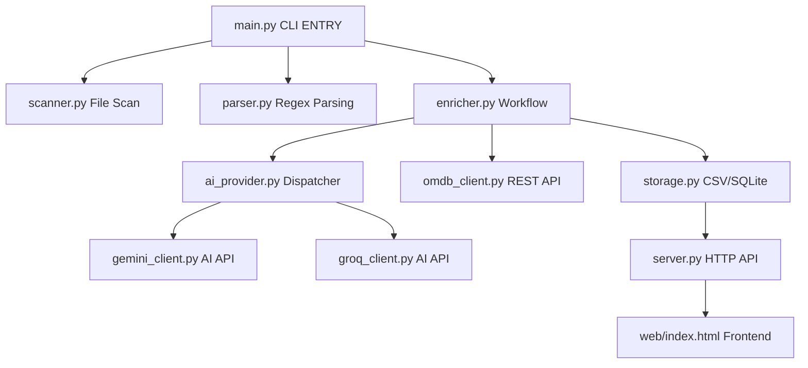

# 💻 Technical Documentation

This document provides technical details about each module, their dependencies, parameters, and how they interconnect in the **Movie Library Manager**.

> **Project layout:** all Python modules referenced below live in the **`src/`** directory (e.g. `src/config.py`, `src/server.py`); these docs live in **`docs/`**; `web/` and `data/` are at the repo root. The app is launched from the repo root via `python src/main.py ...` (or `MovieLibrary.bat`), which puts `src/` on the import path.

---

## Architecture Overview



```
┌─────────────────────────────────────────────────────────────────────┐
│                           main.py                                    │
│                    (CLI Entry Point & Orchestrator)                  │
│└─────────────┬───────────────┬───────────────┬───────────────────────┘
│              │               │               │
│              v               v               v
│┌─────────────┴───┐   ┌───────┴─────┐   ┌─────┴───────────┐
││   scanner.py    │   │  parser.py  │   │   enricher.py   │
││  (File System)  │   │  (Regex)    │   │  (Orchestrator) │
│└────────┬────────┘   └──────┬──────┘   └────┬────────────┘
│         │                   │               │
│         └─────────┬─────────┘               │
│                   │                         │
│                   v               ┌─────────┴──────┬──────────┐
│          ┌────────┴────────┐      │  ai_provider   │  omdb_   │
│          │   storage.py    │<─────┤  -> gemini_    │ client.py│
│          │  (CSV/SQLite)   │      │  or groq_      │ (REST)   │
│          └────────┬────────┘      │  client (AI)   │          │
│                   │               └────────────────┴──────────┘
│                   v
│          ┌────────┴────────┐
│          │    server.py    │
│          │   (HTTP API)    │
│          └────────┬────────┘
│                   │
│                   v
│          ┌────────┴────────┐
│          │  web/index.html │
│          │   (Frontend)    │
│          └─────────────────┘
```

---

## Module Details

### 1. `config.py` - Configuration Hub

**Purpose**: Centralized settings for the entire application.

**Key Variables**:

| Variable | Type | Description |
|----------|------|-------------|
| `MOVIE_DIRECTORY` | Path | Root directory to scan (default: `E:/`) |
| `PROJECT_ROOT` | Path | Absolute path to project root |
| `DATA_DIR` | Path | Directory for CSV/SQLite files |
| `WEB_DIR` | Path | Directory for HTML/CSS/JS files |
| `CSV_FILE` | Path | Path to `movies.csv` |
| `SQLITE_FILE` | Path | Path to `movies.db` |
| `VIDEO_EXTENSIONS` | Set | Supported video formats (.mp4, .mkv, etc.) |
| `LOG_FILE` | Path | Path to `data/enrichment.log` (single consolidated log) |
| `VLC_PATH` | str | Path to VLC executable |
| `GEMINI_API_KEY` | str | Loaded from `.env` |
| `OMDB_API_KEY` | str | Loaded from `.env` |
| `GROQ_API_KEY` | str | Loaded from `.env` (required only when provider = `groq`) |
| `AI_REQUEST_DELAY` | float | Seconds between API calls (rate limiting, default: 3.0) |
| `AI_TIMEOUT_SECONDS` | int | Per-request timeout for AI calls (default: 120). Gemini converts to ms; Groq uses directly |
| `BATCH_SIZE` | int | Movies per chunk in bulk mode (default: 50) |
| `AI_PROVIDER` | str | Active AI backend: `gemini` or `groq` (env override, default: `gemini`) |
| `GROQ_MODEL` | str | Default Groq model (default: `llama-3.3-70b-versatile`) |
| `AI_MODEL` | str | Gemini model for formatting/bulk (default: `gemini-2.5-flash`) |
| `AI_SEARCH_MODEL` | str | Gemini Live API search model (default: `gemini-2.5-flash-native-audio-preview-12-2025`) |
| `SERVER_HOST` | str | Bind host (default: `localhost`) |
| `SERVER_PORT` | int | HTTP server port (default: 8010) |
| `NOISE_PATTERNS` | list | Regex patterns to strip from filenames (word-boundary `\b`-wrapped tokens) |
| `YEAR_PATTERN` | str | Regex to extract 4-digit years (1900-2099) |

**Notes**:
- `AI_PROVIDER` and `GROQ_API_KEY` are read from the environment via `.env`. `AI_MODEL`, `AI_SEARCH_MODEL`, `GROQ_MODEL`, and the numeric settings are hardcoded defaults.
- `NOISE_PATTERNS` tokens use `\b` word boundaries so release tags only match as whole words (e.g. `EVO` no longer truncates "Evolution"). Because the parser replaces `.` with a space *before* noise removal, codec/channel tokens are matched in their space form: `H 264`, `H 265`, `5 1`, `7 1` (not `H.264`/`5.1`).

**Dependencies**: `os`, `pathlib`, `dotenv`

---

### 2. `scanner.py` - File System Scanner

**Purpose**: Recursively scans directories for video files.

**Functions**:

| Function | Parameters | Returns | Description |
|----------|------------|---------|-------------|
| `is_video_file(file_path)` | `Path` | `bool` | Checks extension against `VIDEO_EXTENSIONS` |
| `scan_directory(root_dir)` | `Path` | `Generator[Dict]` | Yields `{file_name, directory, full_path}` for each video |
| `get_all_videos(root_dir)` | `Path` | `List[Dict]` | Wrapper that returns list instead of generator |

**Error Handling**:
- Catches `PermissionError` for system folders
- Skips hidden files (`.` prefix) and system files (`$` prefix)
- Logs warnings without stopping scan

**Dependencies**: `config.py` (for `MOVIE_DIRECTORY`, `VIDEO_EXTENSIONS`)

---

### 3. `parser.py` - Filename Parser

**Purpose**: Extracts movie title and year from messy filenames.

**Functions**:

| Function | Parameters | Returns | Description |
|----------|------------|---------|-------------|
| `clean_filename(filename)` | `str` | `str` | Removes extension, noise patterns, normalizes spaces |
| `extract_year(text)` | `str` | `str` | Extracts valid year (1920-2030) or "NA" |
| `extract_movie_name(filename, year)` | `str, str` | `str` | Extracts title, removes year from name |
| `parse_filename(filename)` | `str` | `Tuple[str, str]` | Returns `(name, year)` tuple |

**Algorithm**:
1. Remove file extension via `Path.stem`
2. Replace separators (`.`, `_`, `-`) with spaces
3. Apply each pattern in `NOISE_PATTERNS` (case-insensitive)
4. Extract year using regex
5. Split name at year boundary

**Dependencies**: `config.py` (for `NOISE_PATTERNS`, `YEAR_PATTERN`)

---

### 4. `storage.py` - Data Persistence Layer

**Purpose**: Manages dual-storage (CSV + SQLite) with synchronization.

**Schema** (30 columns):

```
Core: uuid, file_name, directory, full_path, is_active
Parsed: extracted_name, extracted_year
AI: ai_title, ai_year, ai_imdb_id
OMDb: title, year, genre, director, actors, plot, runtime, 
      language, country, awards, poster, imdb_rating, 
      box_office, imdb_id, additional_info
Metadata: created_at, updated_at
User: user_rating, user_tags
```

**Key Functions**:

| Function | Parameters | Returns | Description |
|----------|------------|---------|-------------|
| `init_csv()` | None | None | Creates CSV with headers if missing |
| `init_sqlite()` | None | None | Creates SQLite database with schema, runs `migrate_db()` |
| `read_csv()` | None | `List[Dict]` | Read all CSV records |
| `append_to_csv(records)` | `List[Dict]` | `int` | Add new records (dedup by `full_path`), returns count |
| `update_csv(records)` | `List[Dict]` | None | Full CSV rewrite |
| `insert_to_sqlite(records)` | `List[Dict]` | `int` | Insert with duplicate skip; counts via `cursor.rowcount` |
| `update_sqlite_record(uuid, updates)` | `str, Dict` | None | Update single record (copies `updates`, stamps `updated_at`) |
| `get_all_movies_sqlite()` | None | `List[Dict]` | Fetch all movies |
| `get_movie_by_uuid(uuid)` | `str` | `Dict or None` | Fetch single movie |
| `get_unenriched_movies()` | None | `List[Dict]` | Movies with `is_active=1` |
| `get_movies_without_omdb()` | None | `List[Dict]` | Movies with `is_active=2` (ordered by `extracted_name`) |
| `reset_failed_to_pending_omdb()` | None | `int` | Reset `is_active` 4 → 2, returns rows changed |
| `get_missing_movie_paths()` | None | `List[Dict]` | Movies where file doesn't exist |
| `remove_missing_movies()` | None | `int` | Delete orphan records (SQLite + CSV rewrite) |
| `save_movies(records)` | `List[Dict]` | `int` | Save to both storages |
| `sync_sqlite_to_csv()` | None | None | Atomic locked read+rewrite of CSV from SQLite |
| `sync_csv_to_sqlite()` | None | None | Sync CSV → SQLite (CSV is source of truth) |

**Write serialization (`threading.RLock`)**:
The web server is multi-threaded, so multiple requests can write concurrently. A module-level re-entrant lock (`_write_lock`) serializes ALL mutating operations so the CSV full-rewrite and SQLite writes cannot interleave (avoids data loss / "database is locked"). It guards: `append_to_csv`, `update_csv`, `insert_to_sqlite`, `update_sqlite_record`, `remove_missing_movies`, `reset_failed_to_pending_omdb`, and `sync_sqlite_to_csv`. It is an `RLock` so a guarded function can call another guarded helper (e.g. `sync_sqlite_to_csv` holds the lock across `get_all_movies_sqlite` + `update_csv`).

**is_active State Machine**:

| Value | State | Meaning |
|-------|-------|---------|
| 0 | Ignored | Will not be processed |
| 1 | Pending AI | New scan, awaiting AI enrichment |
| 2 | Pending OMDb | AI complete, awaiting OMDb |
| 3 | Complete | Fully enriched |
| 4 | Failed | OMDb not found / mismatch / error (needs manual fix) |

**Transitions**:
- scan → `1` (new record, pending AI)
- AI enrich (`1` → `2`)
- OMDb enrich success (`2` → `3`)
- OMDb enrich failed: not found, `verify_match` rejection, or unexpected error (`2` → `4`)
- retry (`reset_failed_to_pending_omdb`): `4` → `2`, then OMDb runs again
- manual enrich (web UI) writes a successful result directly as `3`

**Dependencies**: `csv`, `sqlite3`, `uuid`, `threading`, `datetime`, `pathlib`, `config.py`

---

### 5. `ai_provider.py` - AI Provider Dispatcher

**Purpose**: Thin indirection layer that routes movie-identification calls to the active AI provider (Gemini or Groq). The enrichment pipeline imports `identify_movie` / `identify_movies_bulk` from here instead of a specific client, so the provider can be chosen via config or overridden at runtime.

**Provider Map**: `{"gemini": gemini_client, "groq": groq_client}`. Both client modules expose the **same interface** (`identify_movie`, `identify_movies_bulk`, `set_model`), making them interchangeable.

**Seeding**: the active provider is seeded from `config.AI_PROVIDER` on import; if that value is not a known provider it warns (when non-empty) and falls back to `"gemini"`.

**Functions**:

| Function | Parameters | Returns | Description |
|----------|------------|---------|-------------|
| `set_provider(name)` | `str` | None | Select active provider; raises `ValueError` on unknown name |
| `current_provider()` | None | `str` | Name of the active provider |
| `set_model(model_name)` | `str` | None | Forwards to the active provider's `set_model` |
| `identify_movie(file_name, extracted_name, extracted_year)` | `str, str, str` | `Dict` | Identify one movie via active provider |
| `identify_movies_bulk(movies)` | `list` | `list` | Identify many via active provider |

**Dependencies**: `config.py`, `gemini_client.py`, `groq_client.py`

---

### 6. `gemini_client.py` - Gemini AI Integration

**Purpose**: 2-step AI pipeline for movie identification (unchanged design).

**Architecture**:

```
Step 1: Live API + Search Grounding
   Model: AI_SEARCH_MODEL (gemini-2.5-flash-native-audio-preview-12-2025)
   Input: Filename + parsed data
   Output: Audio transcription with movie details

Step 2: JSON Formatter
   Model: MODEL_FORMATTER = AI_MODEL (gemini-2.5-flash)
   Input: Transcription text
   Output: Structured JSON {movie_title, year, imdb_id}
```

**Reliability**:
- The client is created via `_new_client()` with a per-request timeout: `HttpOptions(timeout=AI_TIMEOUT_SECONDS * 1000)` (HttpOptions timeout is in milliseconds) so a stalled request can't hang the process.
- `generate_content_with_retry(...)` wraps `models.generate_content` with backoff on HTTP 429 / `RESOURCE_EXHAUSTED`, honoring a server-suggested `retryDelay` (parsed from the error) when present, else exponential backoff capped at 60s; re-raises after `max_retries` (default 4). Used by both Step 2 formatting and bulk.

**Functions**:

| Function | Parameters | Returns | Description |
|----------|------------|---------|-------------|
| `get_client()` | None | `genai.Client` | Singleton client (with timeout) |
| `set_formatter_model(model_name)` | `str` | None | Changes `MODEL_FORMATTER` only (Step 2 + bulk); the search model is separate |
| `set_model(model_name)` | `str` | None | Provider-agnostic alias for `set_formatter_model` |
| `generate_content_with_retry(model, contents, config, max_retries)` | ... | response | `generate_content` with 429 backoff |
| `get_search_transcript(file_name, extracted_name, extracted_year)` | `str, str, str` | `str` | Async Live API call |
| `format_with_gemma(transcript)` | `str` | `Dict` | Format transcript to JSON |
| `identify_movie_async(...)` | `str, str, str` | `Dict` | Full async pipeline |
| `identify_movie(...)` | `str, str, str` | `Dict` | Sync wrapper |
| `batch_identify_movies(movies, delay)` | `list, float` | `list` | Sequential processing |
| `identify_movies_bulk(movies)` | `list` | `list` | Single API call bulk mode (search-grounded) |

**Dependencies**: `google-genai`, `asyncio`, `config.py`

---

### 7. `groq_client.py` - Groq AI Integration (alternative provider)

**Purpose**: Alternative provider using Groq's fast OpenAI-compatible chat completions API (Llama and other open models). Exposes the **same interface** as `gemini_client` so the two are interchangeable via `ai_provider`.

**Key differences from Gemini**: no web-search grounding, so it identifies movies from the model's own knowledge. It is told to return an IMDb ID only when certain (else `"NA"`, no guessing); OMDb remains the authoritative verifier by title/year (or by ID when confident).

**Internals**:
- `_chat(messages, json_mode, max_retries)` POSTs to `https://api.groq.com/openai/v1/chat/completions` with `temperature=0` and `timeout=AI_TIMEOUT_SECONDS`. Uses JSON mode (`response_format={"type": "json_object"}`) for standard models. Retries HTTP 429 with backoff honoring `Retry-After`; non-429 errors raise.
- `_supports_json_mode()` returns `False` for `"compound"` grounded/agentic models (they don't support JSON mode); for those, JSON is parsed defensively from text.
- `_extract_json(text)` tolerates markdown fences / surrounding prose, falling back to the first `{...}`/`[...]` block.

**Functions**:

| Function | Parameters | Returns | Description |
|----------|------------|---------|-------------|
| `set_model(model_name)` | `str` | None | Override the active Groq `MODEL` |
| `identify_movie(file_name, extracted_name, extracted_year)` | `str, str, str` | `Dict` | Identify one movie; returns `"NA"` result on failure |
| `identify_movies_bulk(movies)` | `list` | `list` | Single bulk call; empty list on failure |

**Dependencies**: `requests`, `config.py` (`GROQ_API_KEY`, `GROQ_MODEL`, `AI_TIMEOUT_SECONDS`)

---

### 8. `omdb_client.py` - OMDb API Client

**Purpose**: Fetches movie metadata from Open Movie Database.

**Functions**:

| Function | Parameters | Returns | Description |
|----------|------------|---------|-------------|
| `fetch_by_imdb_id(imdb_id)` | `str` | `Dict` | Fetch by IMDb ID (most accurate) |
| `fetch_by_title(title, year)` | `str, str` | `Dict` | Fallback search by title |
| `get_default_response()` | None | `Dict` | Returns all "NA" fields |
| `parse_omdb_response(data)` | `Dict` | `Dict` | Normalize OMDb → internal schema |
| `fetch_movie_data(imdb_id, title, year)` | `str, str, str` | `Dict` | Combined fetch with fallback |

**Dependencies**: `requests`, `config.py`

---

### 9. `enricher.py` - Pipeline Orchestrator

**Purpose**: Coordinates AI and OMDb enrichment workflow. AI identification is called through `ai_provider` (not a specific client), so the active provider is honored.

**Functions**:

| Function | Parameters | Returns | Description |
|----------|------------|---------|-------------|
| `verify_match(ai_title, ai_year, omdb_title, omdb_year)` | `str×4` | `bool` | Fuzzy title match + ±1yr tolerance |
| `enrich_with_ai(limit)` | `int or None` | `int` | Process `is_active=1`; per-movie pipeline; sets state 2 |
| `enrich_with_ai_bulk(limit)` | `int or None` | `int` | Bulk mode; chunk size = `config.BATCH_SIZE` |
| `enrich_with_omdb(limit)` | `int or None` | `int` | Process `is_active=2`; sets state 3 or 4 |
| `retry_failed_omdb(limit)` | `int or None` | `int` | Reset state 4 → 2, then re-run OMDb |
| `full_enrichment(limit)` | `int or None` | `Dict` | Run AI then OMDb |
| `sync_sqlite_to_csv()` | None | None | Delegates to `storage.sync_sqlite_to_csv()` (locked) |

**OMDb enrichment details** (`enrich_with_omdb`):
- Calls `fetch_movie_data(imdb_id=ai_imdb_id, title=ai_title, year=ai_year)` — prefers the AI-found IMDb ID (exact match), else falls back to title/year search.
- If no match (`title == "NA"`): set `is_active=4`.
- Otherwise runs `verify_match(...)` to reject wrong movies from a title-only fallback (remakes / common titles) → `is_active=4`. **Verification is skipped** when the result was matched by the exact AI IMDb ID (`matched_by_id`), which is already unambiguous.
- On success: writes all OMDb fields and `is_active=3`.
- An unexpected exception during a movie also sets `is_active=4` (guarded write) so `--retry-failed` can pick it up, rather than leaving it stuck at state 2.

**Bulk details** (`enrich_with_ai_bulk`): chunk size is `config.BATCH_SIZE` (fallback 50 if unset). Returned ids are stringified into the lookup map (`str(r.get("id"))`) so an LLM that echoes the uuid as a number still matches.

**Workflow**:
1. Get movies with `is_active=1`
2. Call `ai_provider.identify_movie()` (Gemini or Groq)
3. Update AI fields, set `is_active=2`
4. Get movies with `is_active=2`
5. Call `omdb_client.fetch_movie_data()` + `verify_match()`
6. Update OMDb fields, set `is_active=3` (or 4 if not found / mismatch / error)
7. Sync SQLite → CSV

**Logging**: configured centrally in `main.py` (single file `data/enrichment.log`); this module no longer attaches its own file handler.

**Dependencies**: `ai_provider.py`, `omdb_client.py`, `storage.py`, `config.py`

---

### 10. `server.py` - HTTP Server

**Purpose**: Serves web interface and handles API requests. Multi-threaded.

**Endpoints**:

| Method | Path | Body / Params | Response |
|--------|------|---------------|----------|
| GET | `/` (or `/index.html`) | None | `index.html` |
| GET | `/api/movies` | None | JSON array of all movies |
| GET | `/<static>` | None | Static file from `WEB_DIR` (path-traversal confined) |
| POST | `/play` | `{uuid}` | Launches VLC |
| POST | `/api/open-folder` | `{uuid}` | Opens Explorer (selects file) |
| POST | `/api/manual-enrich` | `{uuid, imdb_id?, title?, year?}` | Updates movie via OMDb, sets state 3, syncs CSV |
| POST | `/api/update-metadata` | `{uuid, user_rating?, user_tags?}` | Updates user fields; 404 (`Movie not found`) on unknown uuid |

**Important**: `/play` and `/api/open-folder` are **POST** (they have side effects — launching VLC / Explorer — so POST prevents CSRF via stray ``/links). They are NOT GET query-string endpoints.

**Server / security hardening**:
- `ThreadedTCPServer(ThreadingMixIn, TCPServer)` with `daemon_threads = True` and `allow_reuse_address = True` — concurrent requests so a long OMDb fetch can't block the UI.
- Static serving is **confined to `WEB_DIR`**: the requested path is URL-decoded, joined to `WEB_DIR`, and `resolve()`d; it is served only if it equals the web root or `web_root in file_path.parents` (blocks `/../.env`, `/../config.py`, etc.).
- `send_response()` is overridden to also call `send_security_headers()`, so the **CSP** and `X-Content-Type-Options: nosniff`, `Referrer-Policy: no-referrer`, `X-Frame-Options: DENY` are attached to EVERY response, including stdlib `send_error()` error pages. The wildcard `Access-Control-Allow-Origin: *` CORS header was removed.
- POST handler: validates `Content-Length` (400 on malformed/negative), rejects bodies over `MAX_BODY` (1 MiB) with 413, and the handler has `timeout = 30` so a slow/incomplete request can't pin a worker thread.
- `open_folder` uses the string-form `subprocess.Popen(f'explorer /select,"{path}"')` (required for Explorer's `/select` verb; `shell=False`, path is verified to exist and only the uuid is request-supplied). `play_movie` uses the list form `subprocess.Popen([VLC_PATH, full_path])`.

**Dependencies**: `http.server`, `socketserver`, `subprocess`, `storage.py`, `omdb_client.py`, `config.py`

---

### 11. `main.py` - CLI Entry Point

**Purpose**: Command-line interface for all operations.

**Arguments**:

| Flag | Description |
|------|-------------|
| `--scan` | Scan directory for videos |
| `--limit N` | Limit items to process |
| `--stats` | Show database statistics |
| `--sync` | Sync CSV to SQLite |
| `--check-missing` | Preview missing files |
| `--cleanup` | Remove missing entries |
| `--sample N` | Show N sample records |
| `--enrich` | AI enrichment |
| `--bulk` | Use text-based bulk mode with --enrich |
| `--fetch-omdb` | OMDb enrichment |
| `--full-enrich` | Full pipeline (AI + OMDb) |
| `--retry-failed` | Retry state-4 movies (reset 4 → 2, re-run OMDb) |
| `--provider {gemini,groq}` | Override AI provider for this run (default: `config.AI_PROVIDER`) |
| `--model M` | Override AI model (Gemini shortcuts `2.5`/`3.5`, or a full id e.g. a Groq model) |
| `--server` | Start web server |

**Provider/model overrides**: when `--provider` and/or `--model` are passed, `main` calls `ai_provider.set_provider(...)` / `ai_provider.set_model(...)` before dispatch. `--model` shortcuts `2.5` → `gemini-2.5-flash`, `3.5` → `gemini-3.5-flash`; any other value passes through unchanged. For Gemini, `--model` sets only the formatter/bulk model; the Live-API search model is separate (`AI_SEARCH_MODEL`).

**Logging**: `main.py` calls `logging.basicConfig(..., force=True)` with a console handler and a single `FileHandler(LOG_FILE)` → `data/enrichment.log`. `force=True` is required because imported modules call `basicConfig` at import time, which would otherwise make this a no-op.

---

## Data Flow

```
[Video Files on Disk]
         │
         v
    scanner.py ──────────────> [file_name, directory, full_path]
         │
         v
    parser.py ───────────────> [extracted_name, extracted_year]
         │
         v
    storage.py ──────────────> movies.csv + movies.db (is_active=1)
         │
         v
    ai_provider.py ──────────> [ai_title, ai_year, ai_imdb_id] (is_active=2)
    (gemini_client / groq_client)
         │
         v
    omdb_client.py ──────────> [title, year, genre, poster, ...] (is_active=3)
         │
         v
    server.py ───────────────> JSON API
         │
         v
    web/index.html ──────────> Visual Display
```

## Environment Management

### 12. `setup_env.bat` - Environment Manager

**Purpose**: Sets up an isolated virtual environment using `uv`.
- **Checks for `uv`**: Verifies that the `uv` tool is installed.
- **Creates `.venv`**: Initializes a local virtual environment.
- **Installs Dependencies**: Installs packages from `requirements.txt` using `uv pip`.

### 13. `MovieLibrary.bat` - Windows Launcher

**Purpose**: Environment-aware launcher for the application.
- **Auto-Activation**: Detects and activates the `.venv` folder automatically.
- **Menu System**: Provides a user-friendly interface for scanning, enriching, and starting the server.
- **Setup Integration**: Includes an option to run `setup_env.bat` directly.

---

## External Integrations

- **Google Gemini API**: Default AI provider for movie identification, with web search grounding (2-step Live API search + JSON formatting).
- **Groq API**: Alternative AI provider (OpenAI-compatible chat completions, Llama/open models). No web-search grounding; identifies from model knowledge. Selected via `AI_PROVIDER=groq` or `--provider groq`.
- **OMDb API**: Used for fetching structured metadata (posters, ratings, etc.) and as the authoritative match verifier.
- **VLC Media Player**: External player launched via command line.
- **SQLite**: Local file-based database.
- **CSV**: Human-readable data interchange format.
